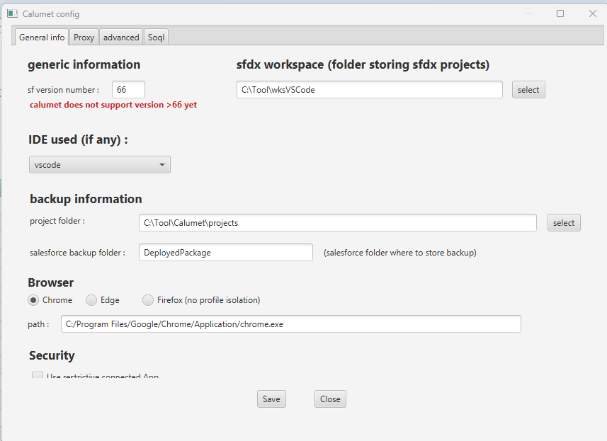
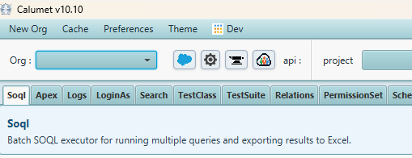
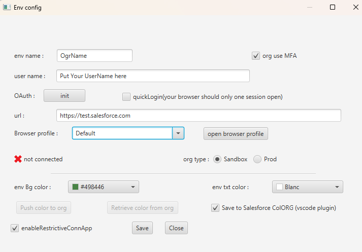
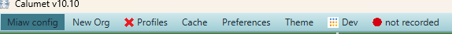
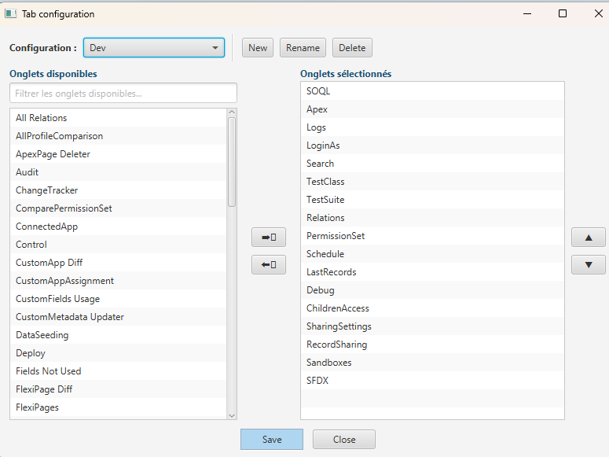

# Getting Started with Calumet

Calumet is a desktop companion for Salesforce administration and DevOps. It talks to
Salesforce through the REST, SOAP (Partner / Metadata / Apex / Tooling), Bulk and
Streaming APIs, and wraps everything in a tabbed GUI so you can query, compare, deploy
and audit orgs without juggling several tools.

This guide walks you through the **five steps** to go from a fresh install to a working,
connected workspace.

> **Conventions used below**
> - Screenshots are referenced from this folder (`docs/starting/`).
> - Field names in **bold** match the labels you see on screen.
> - 💡 callouts are extra context that isn't visible in the screenshot but is good to know.

---

## Before you start — first launch & master password

The very first time you open Calumet, it asks for a **master password**.
This password is **not** sent anywhere: it is the key Calumet uses to encrypt and
decrypt the org credentials stored locally on your machine. Pick one you'll remember — there is
no recovery, only a reset that wipes the stored secrets.

After unlocking, Calumet opens the **global configuration** window (Step 1). On later launches it
goes straight to the main window.

---

## Step 1 — Global configuration

This is the application-wide setup, reachable later from the menu (**config** / **Preferences**).
It is split into tabs — **General info**, **Proxy**, **advanced**, **Soql**. The essentials live in
**General info**.

> **The only mandatory setting to get started is the `sf version number`** (the Salesforce API
> version Calumet uses) — **66 is currently the highest supported version**. Everything else on this
> screen is optional: you can leave it untouched now and fill it in later as you need it.

| Section | Field | What it does |
|---|---|---|
| **Generic information** | **sf version number** | **Required.** Salesforce API version Calumet uses for its calls. ⚠️ Calumet does not support versions above **66** yet — leave it at the supported maximum. |
| | **sfdx workspace** | *(optional)* Root folder where your SFDX / VS Code projects live. Used when Calumet integrates with your IDE. |
| **IDE used (if any)** | dropdown | *(optional)* Your editor (e.g. `vscode`). Enables IDE-specific features such as writing org colors back to the project. |
| **Backup information** | **project folder** | *(optional)* Local folder where Calumet stores its working data and snapshots. |
| | **salesforce backup folder** | *(optional)* Sub-folder name used when Calumet backs up retrieved metadata (default `DeployedPackage`). |
| **Browser** | Chrome / Edge / Firefox + **path** | *(optional)* Which browser Calumet launches for OAuth logins and "open in org" actions. Chrome and Edge support **per-org profile isolation**; Firefox does not (noted in the UI). Set **path** to the browser executable. |
| **Security** | **Use restrictive connected App** | *(optional)* Routes authentication through a locked-down connected app. Leave at the default unless your org policy requires it. |

Click **Save** when done, **Close** to dismiss.

💡 Profile isolation (Chrome/Edge) lets you stay logged into several orgs at once in separate
browser profiles — important if you manage many sandboxes.

---

## Step 2 — The main window

After configuration you land on the main Calumet window. Key elements of the top strip:

- **Menu bar** — `New Org`, `Cache`, `Preferences`, `Theme`, and the **application selector** (see Step 4).
- **Org selector** — the dropdown where you pick which connected org you're working against.
  Next to it: connection / settings / login icons, the **api** version and the current **project**.
- **Tab row** — each tab is a self-contained feature (`SOQL`, `Apex`, `Logs`, `LoginAs`, `Search`,
  `TestClass`, `TestSuite`, `Relations`, `PermissionSet`, `Schedule`, …). The screenshot shows the
  **SOQL** tab: *"Batch SOQL executor for running multiple queries and exporting results to Excel."*

💡 Every tab carries a short description and a help panel at the top — a quick way to learn what a
tab does before using it. Which tabs appear, and in what order, depends on the active **application**
and is fully customizable (Steps 4 & 5).

At this point you still have **no org connected**.

> **Next step → click `New Org`** in the menu bar. This opens the **Env config** window where you
> create your first connection (Step 3).

---

## Step 3 — Create your first org connection

From the menu click **New Org** to open the **Env config** window, then fill it in **in this order**:

1. **env name** — a friendly label for this org (e.g. `DevSandbox`, `Prod`); shown in the org selector.
2. **user name** — the Salesforce login you connect with.
3. **org type** — ⚠️ **check this carefully.** Pick **Prod** for a Production or Developer Edition
   org, **Sandbox** for a sandbox. The wrong choice makes the login fail. The **url** follows
   automatically: `https://login.salesforce.com` (Prod) or `https://test.salesforce.com` (Sandbox).
4. **Browser profile** — choose a **Chrome profile** for this org (keeps each org's session isolated).
   **open browser profile** launches it.
5. **OAuth : init** — click **init** to start the OAuth2 browser login and authorize Calumet.
6. **Connected? choose a color, then Save** — once the indicator turns **✓ connected** (green), pick an
   **env Bg color / env txt color** to tint the UI for this org, then click **Save**.

> **Key point — pick the right `org type`.** For a **Production** or **Developer Edition** org you
> **must** set **org type** to **Prod**, otherwise the login will fail (Calumet would target the
> sandbox endpoint). Use **Sandbox** only for actual sandboxes.

💡 The color tag is more than cosmetic — production orgs are commonly given a strong color so a
mis-targeted deploy or delete is visually obvious before you click. Optional fields like
**org use MFA** and **quickLogin** can be set later.

---

## Step 4 — Choose your application

The menu bar is your hub for everything that isn't a tab. The right-most item (showing the **active
application**, e.g. `Dev`) is the **application selector**.

> **Calumet groups tabs into _applications_** — each application is a named container for a set of
> tabs. **Click the application selector and choose the application you want to start with.**
> Switching application swaps the whole tab row for the set that application defines.

The rest of the menu:

- **config** — reopen the global configuration (Step 1).
- **New Org** — create another org connection (Step 3).
- **Profiles** — profile / permission tooling.
- **Cache** — manage Calumet's local metadata cache (the Tooling cache that speeds up many tabs).
  Use **clear cache** here when a tab shows stale metadata.
- **Preferences** — application preferences, including the **tab configuration** (Step 5).
- **Theme** — switch the visual theme.
- **Application selector** (e.g. `Dev`) — choose which application (set of tabs) is active.
- **● not recorded** — recording status indicator.

💡 If a tab ever shows out-of-date object, field or permission-set data, clearing the cache from
this menu is the first thing to try.

---

## Step 5 — Customize your application

Calumet ships with many more tabs than fit comfortably on screen, so each **application** defines its
own curated set. Open **Tab configuration** (from Preferences) to shape them:

> **Key point — you fully control your applications here.** Add or remove tabs from an existing
> application, reorder them, or **create an entirely new application** for a different workflow
> (e.g. a lightweight "admin" app and a full "developer" app).

- **Configuration** dropdown — the list of **applications** (e.g. `Dev`). Use **New / Rename / Delete**
  to manage them; **New** creates a brand-new application.
- **Available tabs** (left) — every tab Calumet offers, with a filter box to search by name.
- **Selected tabs** (right) — the tabs in the current application, in display order.
- **→ / ←** arrows — move a tab between available and selected.
- **▲ / ▼** arrows — reorder the selected tabs.

Click **Save** to apply. The chosen tabs appear in the main window's tab row whenever that
application is active (Steps 2 & 4).

💡 Start small: build an application with the handful of tabs you use daily (e.g. `SOQL`, `Apex`,
`Logs`, `PermissionSet`, `Deploy`) and add more as you discover them. Create a second application
for occasional, heavier tasks.

---

## You're ready

With the global settings in place (Step 1), at least one org connected (Step 3), and an application
selected and arranged (Steps 4 & 5), you have a working Calumet workspace. From here:

- Pick your org in the selector and start in the **SOQL** tab to confirm the connection.
- Explore **PermissionSet**, **Compare** and **Deploy** tabs for day-to-day admin/DevOps work.
- Each tab's built-in help panel explains its specific options.

Welcome aboard. 🚀
